## Part 1. Удаленное конфигурирование узла через Ansible
### 1.1. Cоздаем Vagrant машины
 - Создаем машины 
    **1.** Создаем папку Vagant
    **2.** Вводим команду vagrant init ubuntu/focal64 находясь в папке Vagrant
    **3.** Прописываем настройки создания машин в появившемся Vagrantfile

*Рис. 1: Настроили Vagrantfile

  - Заходим по ssh на машину node01
   **1.** Узнаем порт
   **2.** Возвращаемся на локальную машину и пробрасываем порт, внеся изменения в vagantfile (на 8080 порту)
   **3.** Перезапускаем машины с помощью vagrant reload

*Рис. 2: Изменили Vagrantfile

  ### 1.2. Подготовим manager как рабочую станцию для удаленного конфигурирования
   **1.** Зашли на manager (vagrant ssh manager)
   **2.** Через ssh пробуем подключиться к node01, предварительно расскомитил PasswordAuthentication

*Рис. 3: Подключились к node01 по паролю 

   **3.** Создали пару ключей через ssh-keygen -C 
   **4.** Перебросили публичный ключ на node01 для подключения без пароля

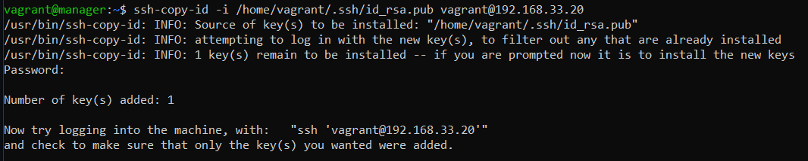
*Рис. 4: Перебросили pub key

   **5.** Заходим на ноду и проверяем в логах аутентификации, что подключены по ключу (для данного отчета)

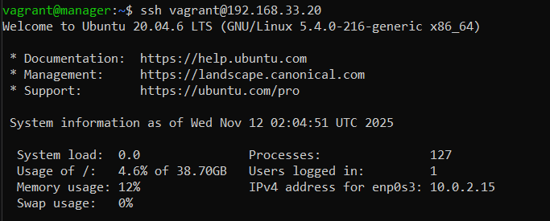
*Рис. 5: Вход на node01

*Рис. 6: Смотрим /var/log/auth.log

   **6.** Через vagrant upload копируем файлы на manager

*Рис. 7: Скопировал файлы на manager

   **7.** Устанавливаем Ansible на manager.Cоздаем папку   ansible. Создаем инвентори-файл
     << **sudo apt update && sudo apt install ansible** >> <<**mkdir ansible**>>
     <<**touch inventory.yml**>>

   **8.** Заполняем инвентори-файл информацией об узлах 

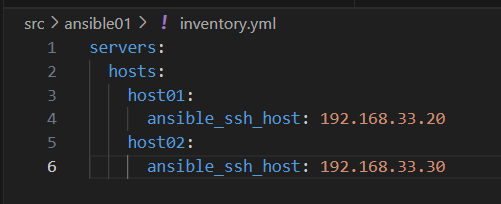
*Рис. 8: Указываем адреса удаленных хостов

   **9.** Запускаем модуль ping для проверки подключения к нодам

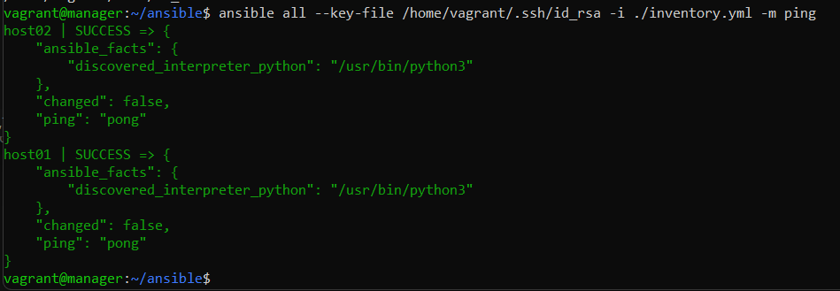
*Рис. 9: Статус SUCCES

  ### 1.3. Первый плейбук для Ansible

   **1.** Создаем файл **node01_playbook.yml** и прописываем конфигурации установки Docker, Docker Compose, группы Docker, коипрвание сервисов и запуск Docker Compose

*Рис. 10: Ansible-playbook

   **2.** Запускаем командой **ansible-playbook node01_playbook.yml -i inventory.yml** наш playbook. После окончания процесса проверяем на ноде успешность запуска микросервисов

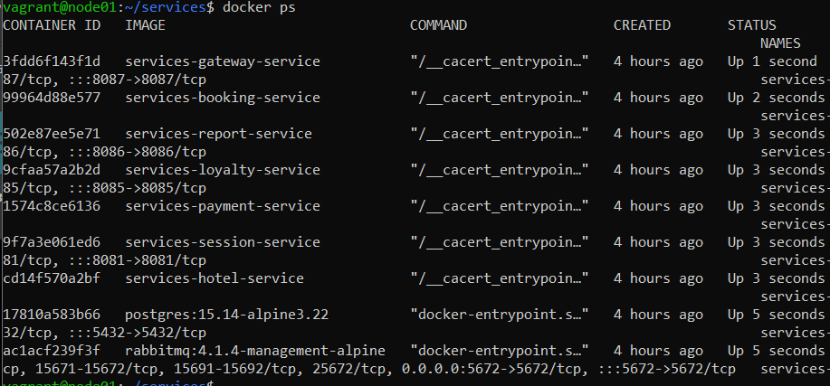
*Рис. 11: docker ps на node01

   **3.** Прогоним сервисы через тесты, запустив на локальной машине **postman collection run ../application_tests.postman_collection.json --verbose --timeout-request 30000 --delay-request 2000**

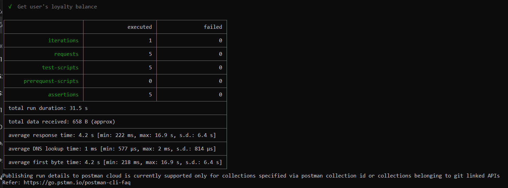
*Рис. 12: Тесты прошли успешно

   **4.** Создаем структуру в директории roles. Создаем роли для сервера Apache
   postgres и application. Пишем таски для каждого из них, а так же общий плейбук в котором прописываем play для каждый ноды

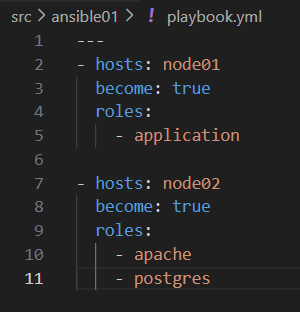
*Рис. 13: Playbook

   **5.** Запускаем playbook и проверяем доступность Apache и выводим таблицу postgres на локальной машине **ansible-playbook -i inventory.yml playbook.yml**
   Вновь запускаем тесты для проверки сервисов. 

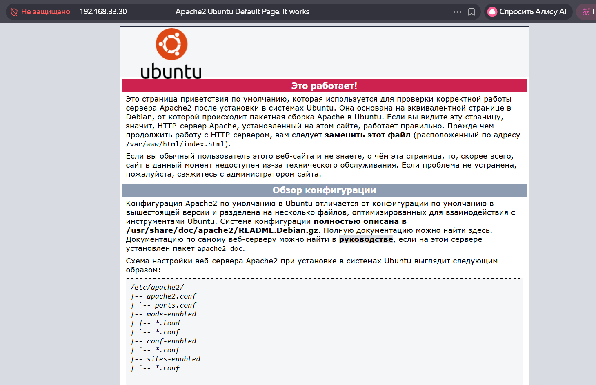
*Рис. 14: Apache доступен

*Рис. 15: Выводим таблицу на локалке

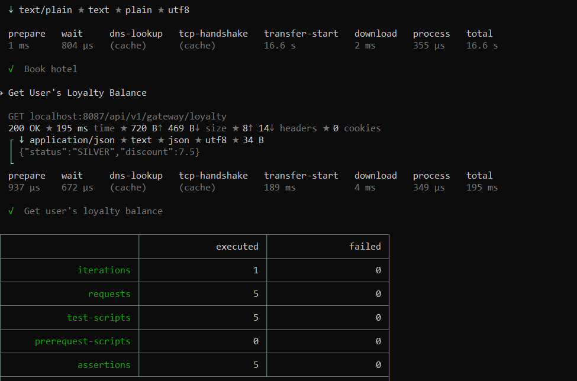
*Рис. 16: Тесты прошли успешно

## Part 2. Service Discovery
### 2.1. Пишем конфиги Consul для сервера и клиента

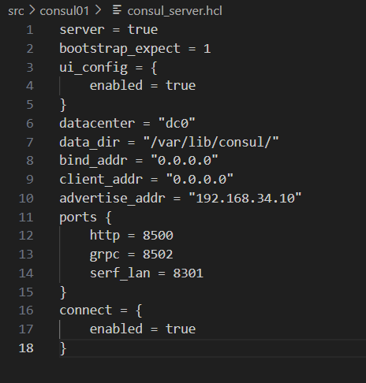
*Рис. 1: Настройки .hcl для сервера

*Рис. 2: Настройки .hcl для клиента

### 2.2. Создаем Vagrantfile
   - Прописываем в файле создание 4-х машин. Создаем общую папку shared для хранения публичного ключа. 
     Синхронизируем папки с приложением, файлами ansible и consul. Пробрасывае порты consul и приложения.
     Устанавливаем Ansible и подключение по ключу с manager на ноды. 

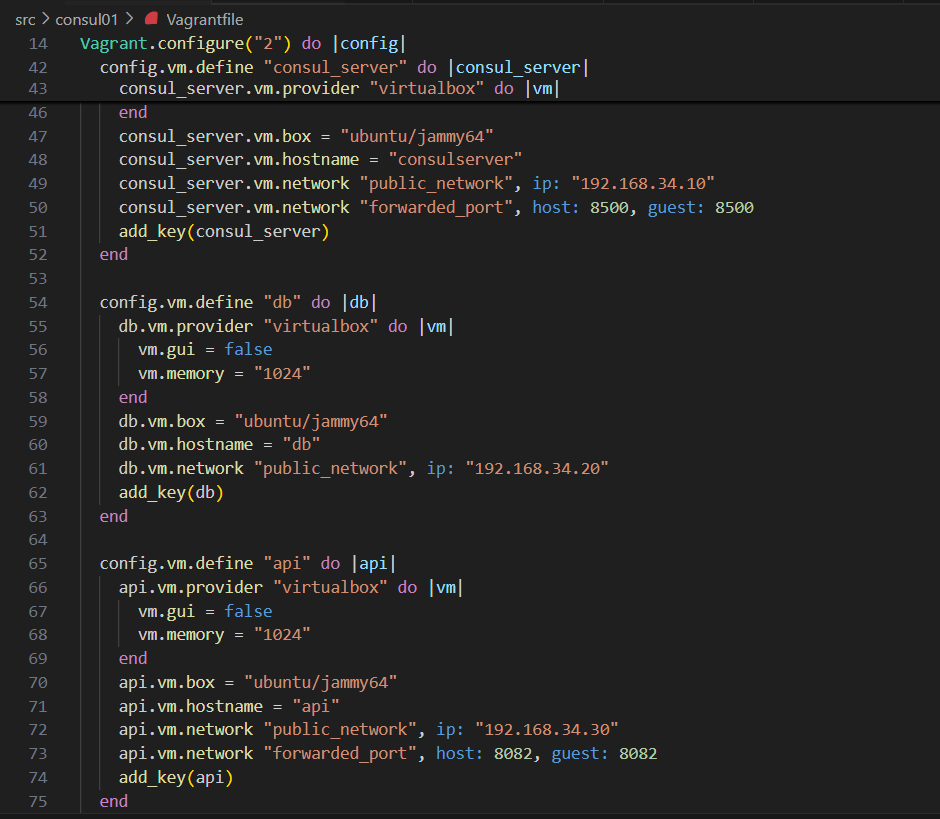
*Рис. 3: Создали машины/пробросили порты

*Рис. 4: Папки скопировались.Запускаем playbook

### 2.3. Запуск плейбука
   - Пишем playbook, inventory, roles. Создаем в тасках необходимые юниты для сервисов и кладем их в files. 
     Прописываем в host_vars переменные имени сервиса и порта для обнаружения на каждой машине (на api приложения, на db - postgesql).
   - Запускаем playbook. Проверяем статусы

*Рис. 5: Приложение запущено

*Рис. 6: Envoy поднят

   - Открываем в браузере на локальной машине UI Консула на порту 8500

*Рис. 8: Сервисы обнаружены/Консул работает

   - На хосте db проверяем заполнение базы данных от приложение на api

*Рис. 9: Данные приложения получены постгресом 

### 2.4. CRUD-операции
   **1.** Cоздаем отель (добавляем в БД)
   - curl -X POST http://localhost:8082/hotels \
   -H "Content-Type: application/json" \
   -d '{
      "hotelUid" : "6a1ca34c-74a2-4486-a038-209ad4c75788",
      "rooms" : 1488, 
      "cost" : 10.0,
      "name" : "Eleon",
      "address" : "Colotushkina 9"
         }'

*Рис. 10: Добавили отель  

   **2.** Смотрим инфо (READ)
   - curl -X POST http://localhost:8082/hotels

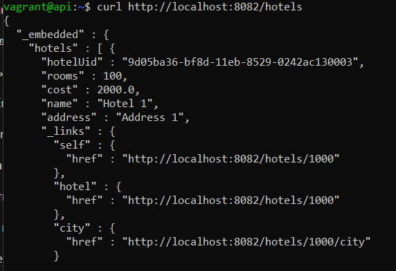
*Рис. 11: Смотрим информацию

   **3.** Обновляем инфо (UPDATE)

   - curl -X PATCH http://localhost:8082/hotels/1 \
   -H "Content-Type: application/json" \
   -d '{
      "address" : "Pushkina 100"
         }'

*Рис. 12: Изменили адрес созданного отеля

   - Ничего не получилось из-за бага в приложении. Аналогичная ситуация с удалением записи